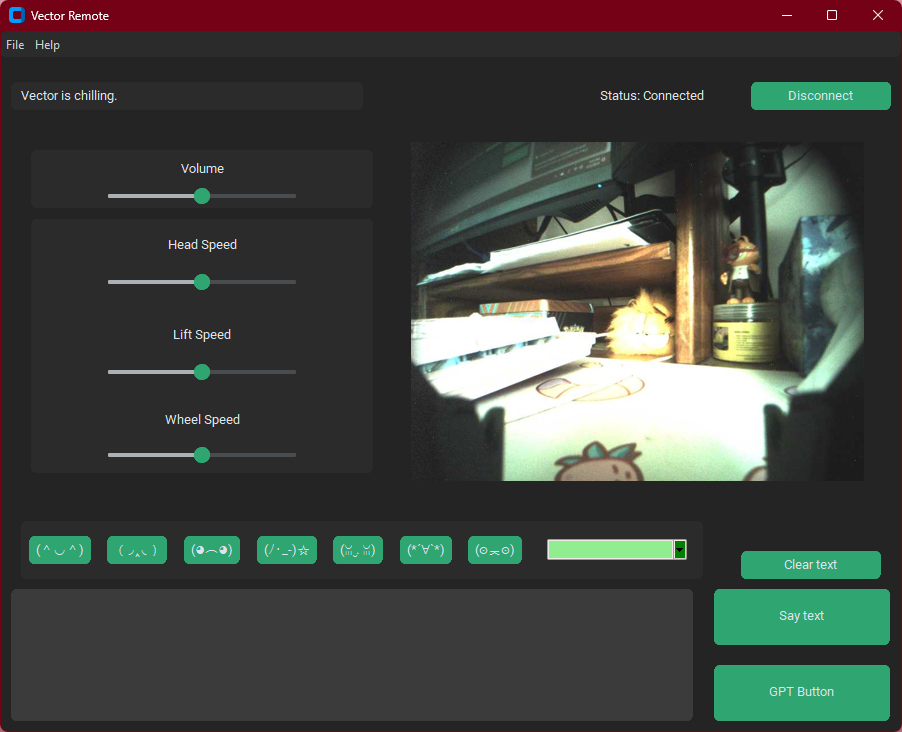
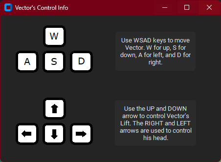
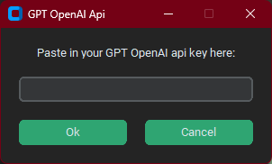

# Vector-Remote-Control
 
🚧 Stand-alone exe in progress 🚧
 
A GUI used enable control of Vector (Anki / DDL (Digital Dream Labs)) through your computer.

Made using [Custom Tkinter](https://github.com/TomSchimansky/CustomTkinter) (Wonderful documentation btw) and [Anki-Vector sdk](https://github.com/anki/vector-python-sdk)

## Whats the point of this program?

Anki / DDL (Digital Dream Labs) does not provide an easy way for their users to control Vector like a remote controlled robot. 
Luckily they have provided a Python SDK which allows people to have access to his peripherals and other attributes.
With this program you can make Vector move, control his speed, speak any text that has been given to him, view his camera, make him dance/animate, and utilize GPT API to have Vector voice Chat GPT responses as a sassy robot assistant.

## Prerequisites

In order to use this you must first obtain a certificate for Vector. Luckiy I have made a program that allows this to be easily done. It can be found here: [Vector Setup](https://github.com/LinditaKalaj/Vector-Setup)

## How to

First you must connect to Vector, to do so there is a green button on the top right labeled connect. This will allow users to gain control of Vector.

After sucessful connection you will have access to all of Vectors controls. To see controls [Click Here](#controls)

Users will have an option to use their gpt-api key to access Vectors gpt function. To see more information [Click Here](#gpt)

## Controls

To check this information during runtime of the program, click on Help > Controls in the file menu.

Vectors controls are simple! Use the WSAD keys to forwards, backwards, left, and right. If two keys are pressed together at the same time, this will enable Vector to move diagonally. 

The up and down arrow keys correspond to Vectors arms. Up is to make his arms go up and down is to bring his arms down.

The left and right arrow keys controls Vectors head tilt. The right arrow will make his head tilt upwards, and the left arrow will make his head tilt downwards.

The GUI provides various options to adjust his wheel, arm and head speed using sliders. 

## GPT

Vector uses GPT 3.5 Turbo's api key.

To use your GPT api key, click on File > GPT API Key in the file menu.

This will write your key in an .env file so Vector can have access to GPT. This only needs to be done one time per key.

For more information on how to obtain a openAI GPT Key please visit the official website [Here](https://openai.com/blog/openai-api)

Please note that these keys have a limited time free trial. Vector uses GPT 3.5 turbo.

